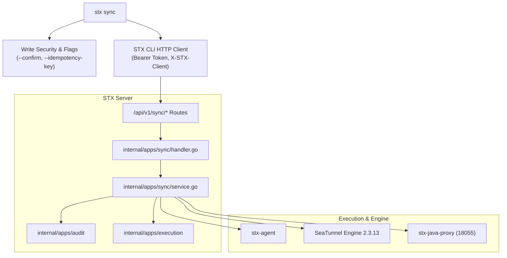
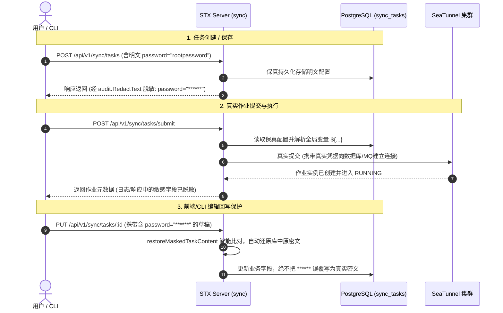

# 数据同步工作台 CLI 全面覆盖与端到端真实作业验收 架构与设计

## 1. 架构总览

本设计将 SeaTunnelX 的数据同步工作台（`internal/apps/sync`）完全纳入平台 CLI 契约体系，实现统一能力发现、安全审计、幂等保障与异步执行跟踪。

---

## 2. 操作登记与契约规范 (`internal/operation/registry.go`)

在平台统一登记表中补充 25 项工作台操作，严格定义风险、参数与示例：

| Operation ID | Method | Route | Mode | Risk | Async | Command Path |
| :--- | :---: | :--- | :---: | :---: | :---: | :--- |
| `sync.task.tree` | GET | `/api/v1/sync/tree` | Normal | R0 | false | `sync task tree` |
| `sync.task.list` | GET | `/api/v1/sync/tasks` | Normal | R0 | false | `sync task list` |
| `sync.task.get` | GET | `/api/v1/sync/tasks/:id` | Normal | R0 | false | `sync task get <id>` |
| `sync.task.create` | POST | `/api/v1/sync/tasks` | Normal | R1 | false | `sync task create` |
| `sync.task.update` | PUT | `/api/v1/sync/tasks/:id` | Normal | R1 | false | `sync task update <id>` |
| `sync.task.delete` | DELETE | `/api/v1/sync/tasks/:id` | Normal | R2 | false | `sync task delete <id>` |
| `sync.task.publish` | POST | `/api/v1/sync/tasks/:id/publish` | Normal | R1 | false | `sync task publish <id>` |
| `sync.task.versions` | GET | `/api/v1/sync/tasks/:id/versions` | Normal | R0 | false | `sync task version list <task_id>` |
| `sync.task.version.rollback` | POST | `/api/v1/sync/tasks/:id/versions/:versionId/rollback` | Normal | R1 | false | `sync task version rollback` |
| `sync.task.version.delete` | DELETE | `/api/v1/sync/tasks/:id/versions/:versionId` | Normal | R2 | false | `sync task version delete` |
| `sync.task.validate` | POST | `/api/v1/sync/tasks/:id/validate` | Normal | R0 | false | `sync task validate <id>` |
| `sync.task.test-connections` | POST | `/api/v1/sync/tasks/:id/test-connections` | Normal | R0 | false | `sync task test-connections <id>` |
| `sync.task.dag` | POST | `/api/v1/sync/tasks/:id/dag` | Normal | R0 | false | `sync task dag <id>` |
| `sync.task.preview` | POST | `/api/v1/sync/tasks/:id/preview` | Normal | R1 | true | `sync task preview <id>` |
| `sync.task.preview.sink-savemode` | POST | `/api/v1/sync/tasks/:id/preview/sink-savemode` | Normal | R0 | false | `sync task preview-savemode <id>` |
| `sync.task.submit` | POST | `/api/v1/sync/tasks/:id/submit` | Normal | R2 | true | `sync task submit <id>` |
| `sync.job.list` | GET | `/api/v1/sync/jobs` | Normal | R0 | false | `sync job list` |
| `sync.job.get` | GET | `/api/v1/sync/jobs/:id` | Normal | R0 | false | `sync job get <id>` |
| `sync.job.logs` | GET | `/api/v1/sync/jobs/:id/logs` | Normal | R0 | false | `sync job logs <id>` |
| `sync.job.checkpoint` | GET | `/api/v1/sync/jobs/:id/checkpoint` | Normal | R0 | false | `sync job checkpoint <id>` |
| `sync.job.preview` | GET | `/api/v1/sync/jobs/:id/preview` | Normal | R0 | false | `sync job preview <id>` |
| `sync.job.cancel` | POST | `/api/v1/sync/jobs/:id/cancel` | Normal | R2 | false | `sync job cancel <id>` |
| `sync.job.recover` | POST | `/api/v1/sync/jobs/:id/recover` | Normal | R2 | true | `sync job recover <id>` |
| `sync.variable.list` | GET | `/api/v1/sync/global-variables` | Normal | R0 | false | `sync variable list` |
| `sync.variable.create` | POST | `/api/v1/sync/global-variables` | Normal | R1 | false | `sync variable create` |
| `sync.variable.update` | PUT | `/api/v1/sync/global-variables/:id` | Normal | R1 | false | `sync variable update <id>` |
| `sync.variable.delete` | DELETE | `/api/v1/sync/global-variables/:id` | Normal | R1 | false | `sync variable delete <id>` |
| `sync.plugin.list` | POST | `/api/v1/sync/plugins/list` | Normal | R0 | false | `sync plugin list` |
| `sync.plugin.options` | POST | `/api/v1/sync/plugins/options` | Normal | R0 | false | `sync plugin options` |
| `sync.plugin.template` | POST | `/api/v1/sync/plugins/template` | Normal | R0 | false | `sync plugin template` |
| `sync.plugin.enum-values` | POST | `/api/v1/sync/plugins/enum-values` | Normal | R0 | false | `sync plugin enum-values` |
| `sync.plugin.enum-catalog` | POST | `/api/v1/sync/plugins/enum-catalog` | Normal | R0 | false | `sync plugin enum-catalog` |

---

## 3. CLI 命令实现体系 (`internal/cmd/sync.go` & `internal/cmd/sync_*.go`)

### 3.1 命令分层设计

1. **`stx sync task`**:
   - `tree`: 读取目录层级树结构。
   - `list`: 分页查看任务，支持 `--cluster-id`、`--keyword` 过滤。
   - `create`: 支持交互或参数输入（`--name`, `--type`, `--cluster-id`, `--config-file` 等）。
   - `dag`: 输出解析后的 DAG 图（Nodes, Edges, Transformations）。
   - `validate`: 校验作业配置，返回是否有错误及警告。
   - `preview`: 异步启动数据抽样会话，返回 `execution_id` 与作业 ID，支持 `--wait` 轮询至输出采样行。
   - `submit`: 提交作业到 SeaTunnel 引擎，返回公共 `execution_id` 与 `job_id`，支持 `--wait` 直接等待最终状态（`RUNNING` 或 `FINISHED`）。
2. **`stx sync job`**:
   - `list`: 按状态、任务 ID 检索作业。
   - `logs`: 支持 `--lines`（默认 200）与 `--all` 追踪作业日志。
   - `checkpoint`: 提取引擎实时 Checkpoint 快照（总数、成功/失败数、持续时间、最后 Checkpoint ID）。
   - `cancel`: 停止作业。关键参数 `--savepoint`：通过引擎触发 Savepoint 写入后再停止作业。
   - `recover`: 针对已停止或失败的作业，携带最近的 Checkpoint/Savepoint 恢复执行。
3. **`stx sync variable` & `stx sync plugin`**:
   - 完备的变量 CRUD 与插件 Schema 查询。

---

## 4. 真实环境端到端验证方案

### 4.1 环境准备
- 启动本地轻量 MySQL 容器 `stx-mysql-e2e`（端口映射 `13306:3306`），预先配置：
  - `binlog_format = ROW`
  - `binlog_row_image = FULL`
  - 创建数据库 `test_stx`，初始化源表 `source_orders` 与目标表 `sink_orders`。

### 4.2 验证流线
1. **CLI 登录与能力校验**：使用 `stx login` 登录本地 STX 服务，查询 `stx capability list` 确认 `sync.*` 全部生效。
2. **任务创建与 DAG/校验**：
   - 编写 MySQL CDC -> Console / MySQL 的 SeaTunnel V2 任务配置文件。
   - `stx sync task create --name "mysql-cdc-test" --cluster-id 1 --config-file ... --confirm`。
   - `stx sync task dag <id>` 查看拓扑。
   - `stx sync task validate <id>` 确认无语法及配置错误。
3. **连通性测试与预览**：
   - `stx sync task test-connections <id>` 探测 MySQL 连通性。
   - `stx sync task preview <id> --wait` 验证能够抽样采集到 MySQL 源表数据。
4. **作业提交与执行跟踪**：
   - `stx sync task submit <id> --confirm --wait`。
   - `stx execution get <execution_id>` 验证与统一执行系统绑定。
   - `stx sync job logs <job_id>` 验证引擎已开始消费或监听 binlog。
5. **Checkpoint、Savepoint 停止与恢复**：
   - 等待产生至少一个 Checkpoint，`stx sync job checkpoint <job_id>` 验证 Checkpoint 存在。
   - 执行 `stx sync job cancel <job_id> --savepoint --confirm` 触发保存点并停止。
   - 执行 `stx sync job recover <job_id> --confirm --wait` 恢复作业，验证从保存点顺利拉起！

---

## 5. 工作台安全与机密脱敏架构 (Secrets Redaction Architecture)

遵循 09-13 核心规范中“机密信息只写不读、传输与终端防泄露、执行保真代入”的设计原则：

1. **展示与审计脱敏（Display & Audit Masking）**：
   - 在任务详情（`sync.task.get`）、任务树（`sync.task.tree`）、版本快照（`sync.task.versions`）以及作业（`sync.job.get`）向 API/CLI 序列化响应前，通过 `sanitizeTaskForResponse`、`audit.RedactText` 和 `redactSyncJSONMap` 自动识别 `password`、`secret`、`token`、`access_key` 等键，将其替换为 `******`。
   - 确保 CLI 终端输出、Web UI、操作审计记录（Audit Log）和网络传输中绝不泄漏凭证明文。
2. **执行保真代入（Fidelity Execution）**：
   - 在触发任务提交（`submit`）、预览（`preview`）、校验（`validate`）或连通性测试（`test-connections`）时，后端服务直接从数据库读取未经脱敏的真实配置，完成全局变量原值代入后与底层数据源和 SeaTunnel 通信。
   - 实际执行使用的是真实密码，数据流向与连接完全通畅。
3. **回写防误覆保护（Restore Protection）**：
   - 后端在 `restoreMaskedTaskContent`（`internal/apps/sync/secrets.go`）中建立智能对齐：当收到用户回传的 `password = "******"` 时，系统自动提取数据库历史中的原密文予以替换还原，只有当用户显式输入了非掩码的新密码时才会覆盖更新。

---

## 6. 工作台用户权限与多租户隔离体系 (Workbench RBAC & User Permission Design)

工作台将权限与租户隔离深度整合进 `internal/apps/auth`、`internal/apps/execution` 和 `internal/apps/sync`：

### 6.1 四级角色权限模型 (Role Hierarchy)

| 角色 (Role) | 核心职责 | 权限范围 | 典型操作 |
| :--- | :--- | :--- | :--- |
| **Admin (系统管理员)** | 平台运维与全局治理 | 跨租户查看与管理全部任务、作业、版本和全局变量；拥有一票控制权与风险操作审批权（R2/R3）。 | 跨用户删除任务、终止任何人的作业、修改共享全局变量、执行节点重启与系统升级。 |
| **Developer (任务开发者)** | 数据同步逻辑研发 | 对自己创建的任务/目录拥有完整创建、编辑、调试（DAG/Validate/Connection/Preview）、发布新版本和提交运行权限；可查阅工作台共享任务。 | `sync task create/update/dag/preview/submit`，管理个人全局变量。 |
| **Operator (运维操作员)** | 生产作业监控与运维 | 针对已发布的正式版本进行提交运行、暂停、Savepoint 触发、从 Checkpoint/Savepoint 恢复重跑；查看作业日志与指标。不可篡改任务脚本代码。 | `sync task submit`，`sync job checkpoint/cancel/recover/logs`。 |
| **Viewer (只读访客)** | 进度查看与审计稽核 | 仅可查阅共享任务的脱敏配置拓扑、DAG 结构、公开作业运行指标及状态日志；无执行和修改权限。 | `sync task list/tree/dag`，`sync job list/get/logs`。 |

### 6.2 资源作用域与所有权规则 (Resource Ownership & Scoping)

1. **任务与目录节点（`sync_tasks`）**：
   - 节点创建时记录 `created_by`（所有者编号）。
   - **私有任务（Private）**：默认策略。只有所有者（CreatedBy）与管理员具备查看、编辑、删除、发布与提交权限。
   - **共享任务（Shared）**：所有者可显式声明共享。允许团队具备权限的其他成员查看脱敏定义、预览 DAG 与提交运行；但**仅所有者与管理员拥有修改脚本、删除任务、发布版本、修改调度表达式的控制权**。
2. **作业执行实例（`sync_job_instances`）**：
   - 执行实例归实际发起提交/预览/恢复的用户所有（`created_by`），并与公共执行系统（`internal/apps/execution`）联动（`owner_user_id`）。
   - 普通用户通过 `ListJobsForActor`、`GetJobForActor` 仅能检索和停止自己发起的作业实例，防止误操作他人作业；管理员可透视全平台作业。
3. **全局变量（`sync_global_variables`）**：
   - 变量区分为工作台公共共享变量与个人私有变量。
   - 变量修改（`sync.variable.update`）与删除（`sync.variable.delete`）严格按所有者或管理员权限校验，非所有者禁止破坏公共变量定义。
   - `secret` 类型的机密变量在全产品链路（API、CLI、日志、审计）永不回显明文，且仅具备授权的任务运行时方可在内存中保真装载代入。
4. **审计与风险控制（Audit & Risk Gates）**：
   - 所有写操作严格按照 R1（单操作影响）与 R2（服务或数据终止影响）分级，必须携带 `--confirm` 或服务端签署确认码。
   - 所有工作台 API 与 CLI 请求均通过中间件记录完整审计跟踪（包含操作者 ID、客户端类型、幂等键、耗时及状态）。

---

## 7. 真实端到端测试验收记录 (Real E2E Verification Report)

本次验证在真实 Linux 环境下，采用 Docker 启动的真实 MySQL 8.0 服务与 SeaTunnel 2.3.13 混合集群进行端到端闭环验证：

1. **JDBC 批量同步端到端**：
   - 源表 `users_src`（3 条种子记录）-> 目标表 `users_sink`。
   - 验证：`stx sync task dag 3` 生成标准 DAG；`stx sync task preview 3` 成功从 MySQL 抽样出 Alice/Bob/Charlie 3 条数据；`stx sync task submit 3 --confirm` 真实提交入库，目标表数据完全同步。
2. **MySQL CDC 增量流式同步端到端**：
   - 任务配置采用 `MySQL-CDC` source 与 `Jdbc` sink，开启 Checkpoint 机制（3000ms 周期）。
   - 验证：
     - `stx sync task submit 4 --confirm` 成功提交集群并进入 `RUNNING` 状态，实时完成初始快照同步。
     - `stx sync job checkpoint 3` 验证 Checkpoint 1~6 周期性生成（`status: COMPLETED`）。
     - 动态插入数据 `David` 到源表，目标表 `users_sink` 毫秒级自动同步新增记录。
     - 执行 `stx sync job cancel 3 --savepoint --confirm` 成功触发并完成 Savepoint 写入（Checkpoint 8, `checkpointType: savepoint`），作业平稳停止。
     - 执行 `stx sync job recover 3 --confirm` 成功以保存点位置重新拉起（`start_with_savepoint: true`），状态恢复为 `RUNNING`。
     - 再次向源表插入新记录 `Emma`，恢复后的作业成功捕获 binlog 并准实时同步至 `users_sink`，全流程无缝连续，无漏数、无重复！
