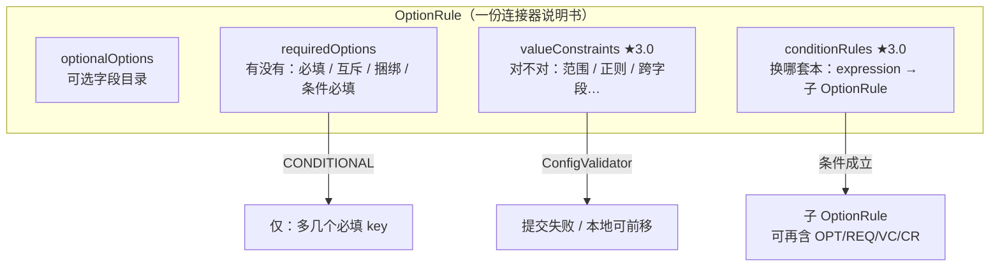
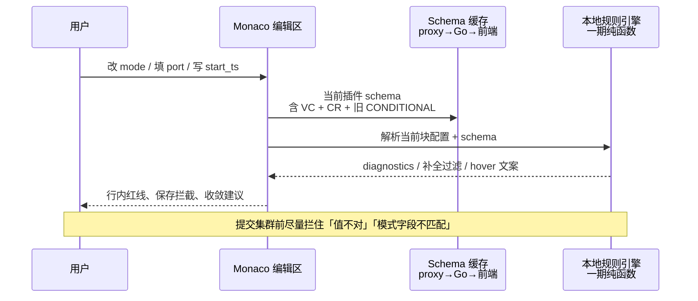

# 设计：SeaTunnel 3.0 OptionRule 与 Sync Studio 编辑交互

## 0. 读者一分钟版

SeaTunnel 3.0 把「这个连接器怎么配才算对」写进了 `optionRule()`，还多了两样新东西：

1. **值合不合法**（`valueConstraints`）——比如端口必须在 1–65535。
2. **条件成立时换一整套规矩**（`conditionRules`）——比如 `mode = TIMESTAMP` 时，启用另一套必填/可选/约束。

我们编辑区现在是 **HOCON 代码编辑器**（不是表单）。所以一期不是做成「条件折叠表单」，而是：

- 写错值 → **立刻标红 / 保存拦住**
- 切了模式 → **补全只推相关字段**
- 悬停字段 → **看得到范围、条件说明**

---

## 1. 大白话：三种「规矩」

把 OptionRule 想成「配置说明书上的三种圈注」：

| 规矩 | 管什么 | 生活比喻 | 3.0 落点 |
|------|--------|----------|----------|
| **有没有**（presence） | 这个字段要不要出现 | 身份证号：填了就行，不看格式 | `requiredOptions`：绝对必填 / 互斥 / 捆绑 / 条件必填（2.x 就有） |
| **对不对**（value） | 填了之后值过不过关 | 手机号：必须 11 位数字 | `valueConstraints`（**3.0 新**） |
| **换哪套本**（nested） | 某种条件下启用另一整本说明书 | 选「企业账户」后换成企业开户材料清单 | `conditionRules`（**3.0 新**） |

### 别和「条件必填」搞混

2.x 的 `.conditional(mode, TIMESTAMP, timestamp)` 只说：

> 当 mode=TIMESTAMP 时，**timestamp 这个字段必须出现**。

它仍落在 `requiredOptions`（`CONDITIONAL`），**不是** `conditionRules`。

`conditionRules` 说的是：

> 当条件成立时，**整棵子 OptionRule** 生效（里面还可以再有必填、互斥、值约束……）。

---

## 2. 图：规矩在引擎里怎么长



官方文档示例（值约束）：

```java
.required(PORT, Conditions.greaterOrEqual(PORT, 1)
    .and(Conditions.lessOrEqual(PORT, 65535)))
.required(START_TS, END_TS, Conditions.lessThanField(START_TS, END_TS))
```

官方 builder 示例（条件子规则）：

```java
.conditionalRule(MODE, StartMode.TIMESTAMP,
    OptionRule.builder()
        .required(TIMESTAMP_VALUE, Conditions.greaterThan(TIMESTAMP_VALUE, 0))
        .build())
```

---

## 3. 图：用户在 Studio 里会感到什么

主路径仍是 Monaco HOCON。交互优化落在 **诊断 / 补全 / hover**，不改编辑范式。



### 场景对照（大白话）

```text
【场景 A：值约束】
  用户写：port = 70000
  现在：保存/提交 → 引擎报错（可能难读）
  目标：编辑时波浪线「port 需 ≤ 65535」；保存按钮可拦截

【场景 B：跨字段】
  用户写：start_ts = 200; end_ts = 100
  目标：两边都标「start_ts 必须 < end_ts」

【场景 C：条件必填（旧）】
  用户写：string.fake.mode = TEMPLATE
  目标：补全优先推 string.template；缺了保存前提示必填

【场景 D：条件子规则（新）】
  用户写：mode = TIMESTAMP
  目标：补全切换到「时间戳子规则」字段集；
        若仍留着另一模式专用字段 → 警告「当前模式可能无效」
```

### 交互优先级（一期）

| 优先级 | 能力 | 用户感知 | 复杂度 |
|--------|------|----------|--------|
| P0 | `valueConstraints` → diagnostics / 保存前校验 | 「写错立刻知道」 | 中（运算符子集） |
| P1 | `CONDITIONAL` + `conditionRules` → 补全过滤 | 「切模式后补全变干净」 | 中 |
| P2 | hover 展示范围 / 条件树摘要 | 「悬停能看懂规矩」 | 低 |
| P3 | 「可移除/应补充」清单面板 | 「一键对照」 | 高（可二期） |
| 不做 | 条件显隐表单 / 可视化向导 | 与 HOCON 主路径冲突 | — |

---

## 4. 现状与缺口

### 现有链路

```text
工厂 optionRule()
  → FactoryOptionRuleExtractor（java-proxy）
  → PluginOptionDescriptor（扁平 options[]）
  → Go sync DTO
  → Sync Studio：hover / enum 补全 / 模板
```

已有字段（扁平 per-option）：

- `required_mode`：OPTIONAL / ABSOLUTELY_REQUIRED / EXCLUSIVE / BUNDLED / CONDITIONAL
- `condition_expression`：条件**字符串**（不可靠驱动 UI）
- `constraint_group`：互斥/捆绑分组
- `enum_values` 等

### 缺口

| 能力 | 引擎 3.0 | STX 现状 |
|------|----------|----------|
| `valueConstraints` | 有 | **未抽、未透传、未消费** |
| `conditionRules` + 嵌套 OptionRule | 有 | **未抽** |
| `expressionTree` | REST 有结构化树 | 仅 `toString()` |
| 行内值校验 | 引擎提交期 | 编辑区无 |
| 按条件收敛补全 | 有数据可做 | 未做 |

本地探活：FakeSource 的 `conditionRules`/`valueConstraints` 常为空——它多用旧式 `CONDITIONAL` presence；**不等于 3.0 API 不存在**，只是该连接器还没声明新约束。

---

## 5. 数据契约（草案）

原则：**向后兼容**——2.x / 旧前端无视新字段；3.x 无数据则 `[]`。

### 5.1 顶层 schema 增加（推荐）

不要把嵌套树硬塞进每个 option 的扁平字段；与引擎 REST 形状对齐：

```json
{
  "plugin_type": "source",
  "factory_identifier": "FakeSource",
  "options": [ /* 现有扁平列表，继续服务补全/hover */ ],
  "value_constraints": [
    {
      "option_key": "port",
      "operator": "GREATER_OR_EQUAL",
      "expect_value": 1,
      "compare_option_key": null,
      "and_next": { "...": "链式 Condition 可展平为列表或保留 next" },
      "extension_description": null
    }
  ],
  "condition_rules": [
    {
      "expression": "'mode' == TIMESTAMP",
      "expression_tree": {
        "option_key": "mode",
        "operator": "EQUAL",
        "expect_value": "TIMESTAMP",
        "and": null,
        "next": null
      },
      "option_rule": {
        "options": [],
        "value_constraints": [],
        "condition_rules": []
      }
    }
  ],
  "warnings": []
}
```

### 5.2 扁平 option 侧（兼容增强）

保留并增强现有字段，供补全快速路径：

- `condition_expression`：继续填；有 tree 时前端优先用 tree
- 可选新增 `condition_expression_tree`（与上同形）
- `required_mode` / `constraint_group` 语义不变

### 5.3 运算符一期子集（本地可执行）

与 `ConditionOperator` 对齐，一期只实现可纯数据评估的：

| 类别 | 运算符 |
|------|--------|
| 比较 | EQUAL, NOT_EQUAL, GREATER_THAN, GREATER_OR_EQUAL, LESS_THAN, LESS_OR_EQUAL |
| 字符串 | NOT_BLANK, STARTS_WITH, CONTAINS, MATCHES |
| 集合 | NOT_EMPTY, COLLECTION_UNIQUE, MAP_NOT_EMPTY, MAP_CONTAINS_KEY(S) |
| 跨字段 | FIELD_LESS_THAN, FIELD_LESS_OR_EQUAL, FIELD_GREATER_THAN, FIELD_GREATER_OR_EQUAL |
| 降级 | EXTENSION → 仅展示 `extension_description`，**不本地执行** |

大小写规范化（UPPER_CASE / LOWER_CASE）一期可只做 hover 提示，不做强制改写。

### 5.4 数据流选型

```text
主路径（定稿）：
  v3 java-proxy 读本地 OptionRule
    → 填充 value_constraints / condition_rules
    → Go → Studio

对照路径（可选，非主依赖）：
  GET {engine}/option-rules?type=&plugin=
    → 仅调试/一致性探针
```

理由：与现有 schema/template/enum 一致；不绑引擎在线；双代际 v3 jar 已具备 3.0 API。

---

## 6. 分层职责

| 层 | 职责 |
|----|------|
| `FactoryOptionRuleExtractor`（v3） | 读 `getValueConstraints()` / `getConditionRules()`；序列化 Condition / Expression 树；嵌套 OptionRule 递归 |
| `PluginOptionSchemaResult` | 顶层增加列表字段；warnings 记录无法序列化的 extension |
| Go `internal/apps/sync` | DTO 透传；不做语义重解释 |
| Studio | 解析当前插件块 → 评估约束 → Monaco markers；补全过滤；hover 文案 |
| 2.x extractor | 新字段返回空列表 |

### 编辑区评估输入

```text
输入：
  - 当前光标所在 source/transform/sink 块的 key→value（尽力解析 HOCON）
  - 该 factory 的 schema（options + value_constraints + condition_rules）

输出：
  - Diagnostic[]（severity + 中文 message）
  - CompletionFilter（允许/加权的 key 集合）
  - HoverExtra（约束摘要）
```

HOCON 解析失败时：不做错误标记（避免误伤），仅降级为「无本地校验」。

---

## 7. 与双代际的关系

- **v3 jar**：编译期可直接 `import` 3.0 `Condition` / `ConditionRule` / `Conditions`。
- **v2 jar**：无这些 getter；extractor 分支返回空。
- 若嵌套规则与反射成本过高，可触发 `09-30-java-proxy-dual-epoch` 设计中的 **adapter 拆分**；一期优先在 v3 源码路径用编译期 API，v2 桩实现。

---

## 8. 风险与降级

| 风险 | 处理 |
|------|------|
| 多数连接器尚未声明 VC/CR | 空列表；旧 CONDITIONAL 仍工作；不假装有约束 |
| HOCON 动态值 / 变量 `{{x}}` | 含未解析变量的字段跳过值约束 |
| Condition 链式 and/or | 一期支持；过深树可截断并 warning |
| EXTENSION 无法跨进程执行 | 只展示描述；提交仍靠引擎 |
| 前后端运算符枚举漂移 | 未知 operator → warning，不崩溃 |

---

## 9. 验收场景（设计级）

1. **Port 越界**：配置 `port = 70000` 且 schema 有 `1..65535` → 编辑区出现诊断；保存可拦截。
2. **跨字段**：`start_ts > end_ts` → 两侧诊断。
3. **条件必填**：满足旧 CONDITIONAL 条件但缺字段 → 保存前提示。
4. **条件子规则**：命中 `conditionRules` 后，补全候选以子规则字段为主。
5. **2.x 集群**：无新字段；补全/hover 与现网一致。
6. **变量占位**：`port = {{port}}` → 不报值约束假阳性。

---

## 10. 决策摘要

| 决策 | 结论 |
|------|------|
| 主数据源 | java-proxy OptionRule（v3），非引擎 REST |
| 编辑范式 | 保持 HOCON；增强诊断/补全/hover |
| 一期重点 | **proxy ConfigValidator 校验** > schema 透传 VC/CR > hover |
| 契约形态 | schema 顶层 `value_constraints` + `condition_rules`，扁平 options 兼容保留 |
| 表单化 | 不做 |
| EXTENSION | 只透传描述 |
| 草稿保存 | 不硬拦 OptionRule；校验/提交前 preflight 硬拦 |

---

## 11. 开放问题（实现前可再定）

1. ~~保存拦截：硬拦 vs 可「仍要保存」二次确认？~~ → **草稿不拦；校验/发布/提交硬拦**
2. `condition_rules` 嵌套深度 UI 是否只展平一层补全？（二期）
3. 是否在任务提交链路复用同一套校验？→ **已复用** `ValidateTask` → `/config/validate`
