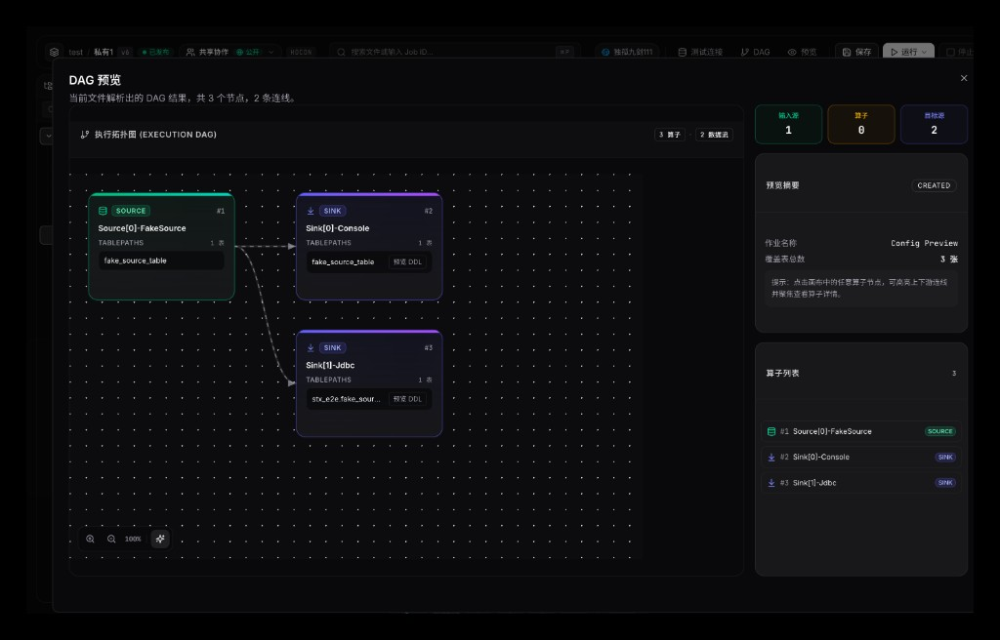

# STX

**One-stop SeaTunnel ops platform** — make SeaTunnel ops no longer a black box.

[中文文档](./README_CN.md) · [Secondary development](./docs/secondary-development.md) · [Quick start (CN)](./docs/00-快速开始.md)

## Why STX

Running SeaTunnel in production is rarely “just submit a job”. Teams also need host monitoring, cluster restart, install and upgrade, connector distribution, config changes, runtime diagnosis, Checkpoint inspection, and recovery after job failures.

STX is the control plane for that work: one place to manage hosts, clusters, packages, plugins, monitoring, diagnostics, and job operations — with a native AI Agent ops entry (CLI + Skill).

## Highlights

- **Host & Agent** — host onboarding, Agent install, heartbeat and capacity
- **Cluster lifecycle** — create, deploy, start/stop, and upgrade SeaTunnel clusters
- **Packages & plugins** — package management and connector marketplace installs
- **Observability & diagnosis** — monitoring center, inspections, error clues, recovery actions
- **Job workbench** — HOCON/DAG workflows, Checkpoint visualization, debuggable runs
- **AI Agent entry** — CLI + Skill oriented intelligent ops entry (in progress)
- **Auth & audit** — password login, optional GitHub/Google OAuth, audit logs, user admin

## Screenshots

| Page | Preview |
| --- | --- |
| Login |  |
| Dashboard |  |
| Workbench |  |
| DAG |  |
| Hosts |  |
| Clusters |  |
| Monitoring |  |
| Diagnostics |  |
| Packages |  |
| Plugins |  |
| User Center |  |

## Architecture

```
┌─────────────────┐     ┌─────────────────┐     ┌─────────────────┐
│  Frontend       │     │  Backend        │     │  Database       │
│  Next.js        │◄───►│  Go (Gin)       │◄───►│  SQLite/MySQL/  │
│  React 19       │     │  GORM + gRPC    │     │  PostgreSQL     │
└─────────────────┘     └────────┬────────┘     └─────────────────┘
                                 │
                                 ▼
                        ┌─────────────────┐
                        │  STX Agent      │
                        │  on each host   │
                        └─────────────────┘
```

## Supported platforms

One-click control-plane install targets **Linux** on **amd64 / arm64**.

| Distro | amd64 | arm64 | Notes |
| --- | --- | --- | --- |
| Ubuntu / Debian | Yes | Yes | Preferred; skip Node download if local Node ≥ 18.18 |
| Rocky / Alma / CentOS Stream / RHEL 8+ | Yes | Yes | Official Node 22 |
| CentOS 7 (glibc 2.17) | Yes | **No** | amd64 only via `node-18-glibc217`. No arm64 glibc217 Node build |
| Other systemd Linux | Usually | Usually | Needs glibc ≥ 2.17; glibc &lt; 2.27 follows CentOS 7 Node rules |

macOS / Windows are for local development, not the one-click installer. Default ports: API **17800**, frontend **17880**, gRPC **17890**.

## Quick start

### Requirements (local development)

- Go >= 1.24
- Node.js >= 18
- pnpm >= 8 (recommended)

### Run locally

```bash
git clone https://github.com/LeonYoah/stx.git
cd stx
cp config.example.yaml config.yaml

go mod tidy
go run main.go api
```

In another terminal:

```bash
cd frontend
pnpm install
pnpm dev
```

Open `http://localhost:3000` and sign in with `admin` / `admin123` (or the values in `config.yaml`).

### Online install (recommended)

Installs the latest Release by default.

```bash
# Global
curl -fsSL https://github.com/LeonYoah/stx/releases/latest/download/install-online.sh | bash

# China (URL already wrapped with gh-proxy)
curl -fsSL https://v4.gh-proxy.org/https://github.com/LeonYoah/stx/releases/latest/download/install-online.sh | bash
```

Useful flags: `--install-dir /opt/stx`, `--arch amd64|arm64`, `--without-node`, `--without-observability`, `--no-systemd`, `--no-start`.  
Scripts pick Node variant from glibc (&lt;2.27 → glibc217); skip Node when local ≥ 18.18, or pass `--without-node`.

### Offline install (script-built bundle)

```bash
curl -fsSL https://github.com/LeonYoah/stx/releases/latest/download/download-bundle.sh | bash
# China: https://v4.gh-proxy.org/https://github.com/LeonYoah/stx/releases/latest/download/download-bundle.sh
```

| Environment | Bundle includes Node? |
| --- | --- |
| glibc ≤ 2.17 (CentOS 7) | Yes — `node-18-glibc217` (**amd64 only**) |
| glibc > 2.17 and local Node ≥ 18.18 | **No** (or `--without-node`) |
| glibc > 2.17 without usable Node | Yes — `node-22-official` |

CentOS 7: `bash -s -- --node-variant glibc217 --arch amd64`. Output: `dist/offline/stx-offline-bundle-*.tar.gz`.

```bash
tar -xzf dist/offline/stx-offline-bundle-*-linux-*.tar.gz
cd stx-offline-bundle-*-linux-*
sudo ./install.sh --install-dir /opt/stx --offline
```

### Manual download (cannot run scripts)

1. Download helpers: [stx-install-helpers.tar.gz](https://github.com/LeonYoah/stx/releases/latest/download/stx-install-helpers.tar.gz)  
2. Put assets below into `packages/`  
3. `./install.sh --offline`  

China: paste links into [https://gh-proxy.com/](https://gh-proxy.com/).

| Asset | amd64 | arm64 |
| --- | --- | --- |
| stx | [download](https://github.com/LeonYoah/stx/releases/latest/download/stx-linux-amd64) | [download](https://github.com/LeonYoah/stx/releases/latest/download/stx-linux-arm64) |
| frontend | [download](https://github.com/LeonYoah/stx/releases/latest/download/frontend-standalone-linux-amd64.tar.gz) | [download](https://github.com/LeonYoah/stx/releases/latest/download/frontend-standalone-linux-arm64.tar.gz) |
| stx-agent | [download](https://github.com/LeonYoah/stx/releases/latest/download/stx-agent-linux-amd64) | [download](https://github.com/LeonYoah/stx/releases/latest/download/stx-agent-linux-arm64) |
| observability | [download](https://github.com/LeonYoah/stx/releases/download/deps/observability-prom3.9.1-am0.31.1-gf12.3.3-linux-amd64.tar.gz) | [download](https://github.com/LeonYoah/stx/releases/download/deps/observability-prom3.9.1-am0.31.1-gf12.3.3-linux-arm64.tar.gz) |

```bash
ldd --version | head -1
node -v
```

| Environment | amd64 | arm64 |
| --- | --- | --- |
| glibc ≤ 2.17 (CentOS 7) | [node-18-glibc217](https://github.com/LeonYoah/stx/releases/download/deps/node-18-glibc217-linux-amd64.tar.gz) | unsupported |
| glibc > 2.17, no Node ≥ 18.18 | [node-22-official](https://github.com/LeonYoah/stx/releases/download/deps/node-22-official-linux-amd64.tar.gz) | [node-22-official](https://github.com/LeonYoah/stx/releases/download/deps/node-22-official-linux-arm64.tar.gz) |
| Node ≥ 18.18 already | skip | skip |

### Docker full stack

Release asset: `stx-docker-compose.tar.gz` (wired in packaging; available on **new tags**, not yet on older `latest` if 404).

```bash
mkdir -p stx-docker && cd stx-docker
curl -fsSL https://github.com/LeonYoah/stx/releases/latest/download/stx-docker-compose.tar.gz | tar -xz
cd docker
cp config.example.yaml config.yaml   # edit database for the compose file you use
docker compose up -d                 # MySQL default
```

China: paste into [gh-proxy.com](https://gh-proxy.com/), or use the `v4.gh-proxy.org/https://github.com/...` URL.

China images (Huawei SWR): set `STX_IMAGE_REGISTRY=swr.cn-east-3.myhuaweicloud.com/stx` in `.env`, or:

```bash
cp .env.cn.example .env
docker compose up -d
```

| DB | Start |
| --- | --- |
| MySQL (default) | `docker compose up -d` |
| SQLite | `docker compose -f docker-compose.sqlite.yml up -d` |
| PostgreSQL | `docker compose -f docker-compose.postgres.yml up -d` |

| Service | URL |
| --- | --- |
| UI | http://127.0.0.1:17880 |
| API | http://127.0.0.1:17800 |
| Grafana | http://127.0.0.1:3000 |
| Prometheus | http://127.0.0.1:9090 |
| Alertmanager | http://127.0.0.1:9093 |

Single container (no monitoring):

```bash
# Global GHCR
docker run -d -p 17800:17800 -p 17880:17880 -p 17890:17890 ghcr.io/leonyoah/stx-all-in-one:latest
# China Huawei SWR
docker run -d -p 17800:17800 -p 17880:17880 -p 17890:17890 swr.cn-east-3.myhuaweicloud.com/stx/stx-all-in-one:latest
```

After binary install: `/opt/stx/bin/start.sh` (default `--observability auto`) or `systemctl restart stx`.  
Optional: `/opt/stx/bin/start.sh --observability off`.

More: [docs/00-快速开始.md](./docs/00-快速开始.md), [docs/打包发布说明.md](./docs/打包发布说明.md), [docs/可观测性三件套一键接入说明.md](./docs/可观测性三件套一键接入说明.md).

## Configuration essentials

| Key | Purpose | Default |
| --- | --- | --- |
| `auth.default_admin_username` | Initial admin username | `admin` |
| `auth.default_admin_password` | Initial admin password | `admin123` |
| `database.type` | Database type | `sqlite` |
| `app.addr` | HTTP listen address | see `config.example.yaml` |
| `grpc.port` | Agent gRPC port | see `config.example.yaml` |

Optional OAuth providers (`github` / `google`) can be enabled under `oauth_providers` in `config.yaml`. Callback URL is typically `http://localhost:3000/callback`.

## Docs

- [Quick start (users)](./docs/00-快速开始.md)
- [Secondary development](./docs/secondary-development.md)
- [Packaging & release](./docs/打包发布说明.md)
- [Observability integration](./docs/可观测性三件套一键接入说明.md)

## License

Apache License 2.0. See [LICENSE](./LICENSE).

This project was originally adapted from [linux-do/cdk](https://github.com/linux-do/cdk) (MIT).

## Links

- [Apache SeaTunnel](https://seatunnel.apache.org/)
- [STX on GitHub](https://github.com/LeonYoah/stx)
