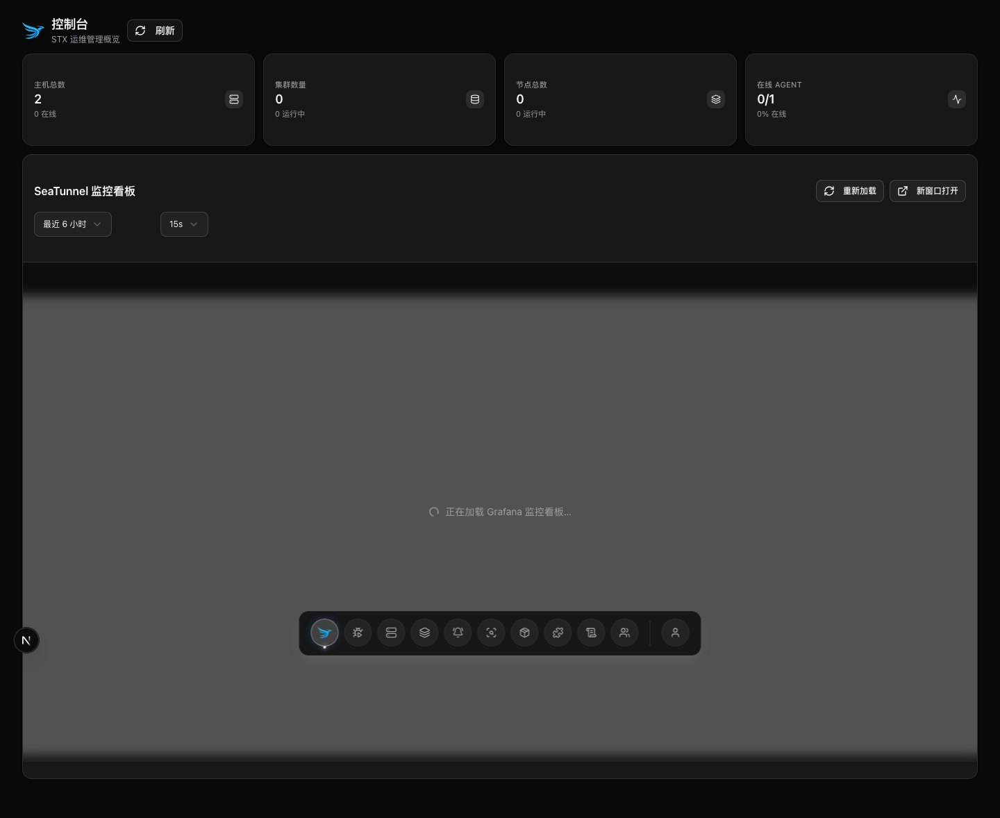
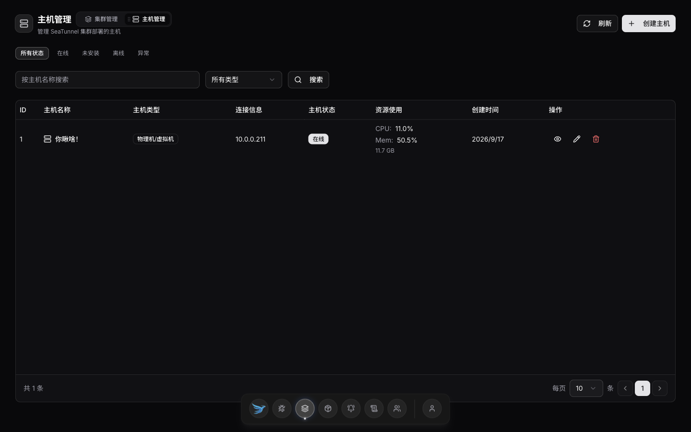
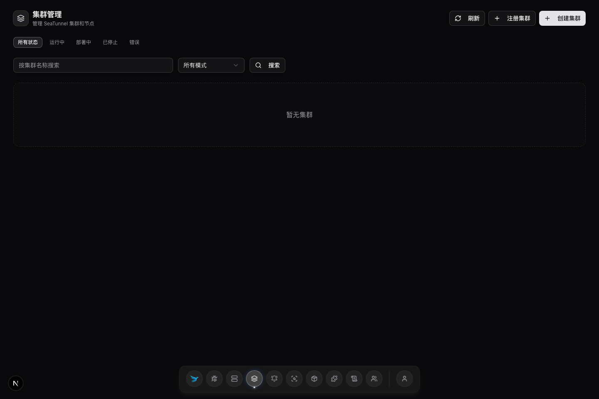
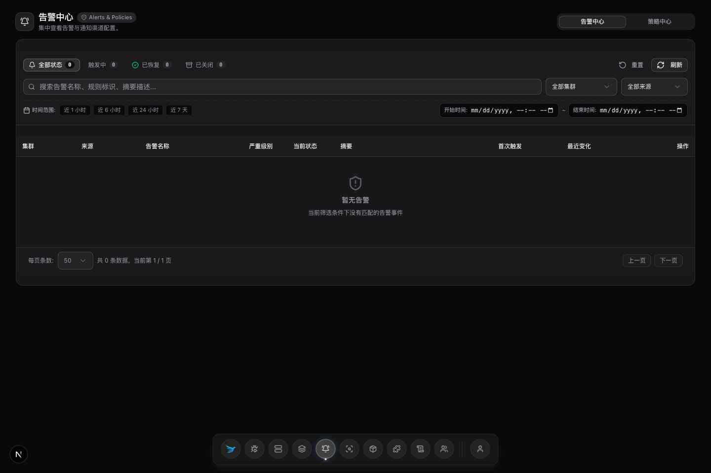
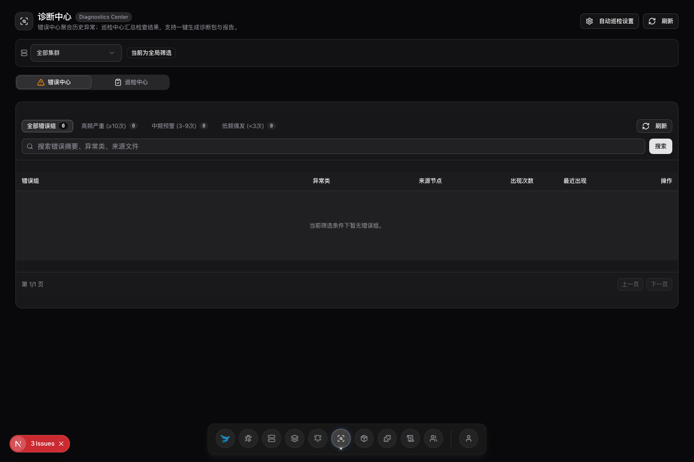
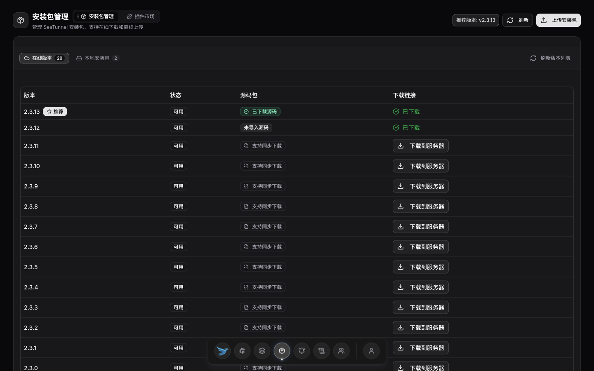
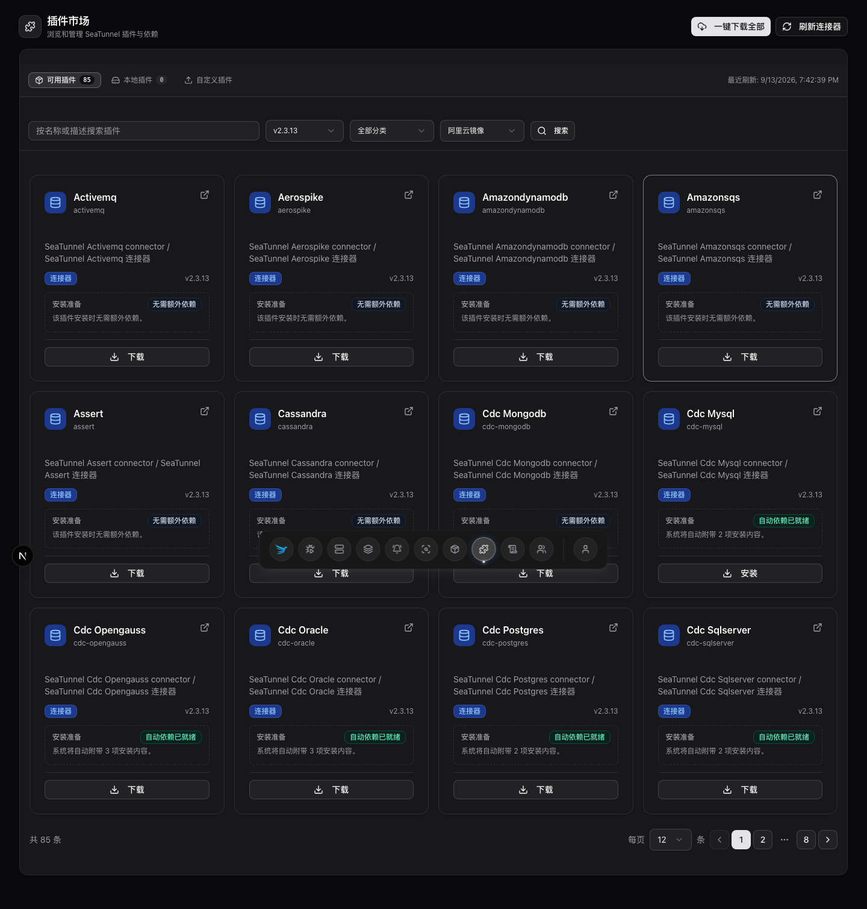
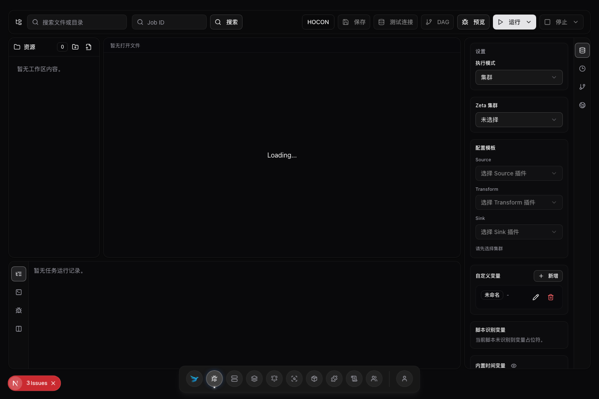
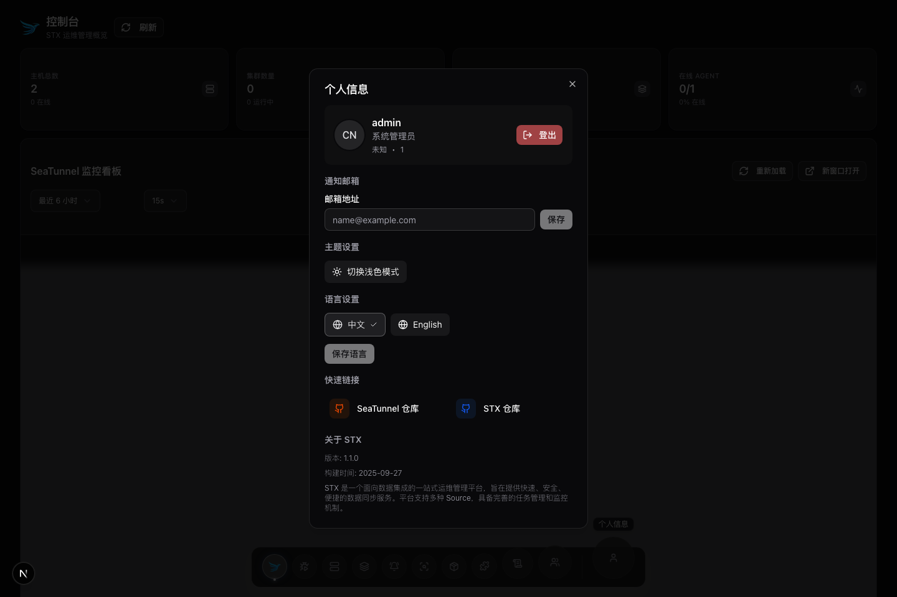

# STX

**SeaTunnel 一站式运维平台** — 让 SeaTunnel 运维不再黑箱。

[English](./README.md) · [二次开发](./docs/二次开发.md) · [快速开始](./docs/00-快速开始.md)

## 为什么做 STX

线上跑 SeaTunnel，很少只是「提交一个任务」就结束。团队还要管主机监控、集群重启、集群安装升级、连接器分发、配置变更、运行诊断、Checkpoint 排查，以及任务故障后的恢复。

STX 就是围绕这些事的控制面：把主机、集群、安装包、插件、监控、诊断和任务操作收敛到一个统一入口。并原生提供 AI Agent 智能运维入口（CLI + Skill）。

## 能力一览

- **主机与 Agent** — 主机接入、Agent 安装、心跳与容量
- **集群生命周期** — 创建、部署、启停、升级 SeaTunnel 集群
- **安装包与插件** — 包管理、连接器市场安装
- **可观测与诊断** — 监控中心、巡检、异常线索、恢复动作
- **任务工作台** — HOCON/DAG 流程、Checkpoint 可视化、可调试运行
- **AI Agent 入口** — 面向 CLI + Skill 的智能运维入口（建设中）
- **认证与审计** — 账密登录、可选 GitHub/Google OAuth、审计日志、用户管理


## 界面截图


| 页面   | 预览                                           |
| ---- | -------------------------------------------- |
| 登录   |          |
| 控制台  |     |
| 工作台  |     |
| 主机管理 |        |
| 集群管理 |     |
| 监控中心 |   |
| 诊断中心 |  |
| 安装包  |      |
| 插件市场 |      |
| 数据同步 |         |
| 用户中心 |  |


## 架构

```
┌─────────────────┐     ┌─────────────────┐     ┌─────────────────┐
│  前端           │     │  后端           │     │  数据库         │
│  Next.js        │◄───►│  Go (Gin)       │◄───►│  SQLite/MySQL/  │
│  React 19       │     │  GORM + gRPC    │     │  PostgreSQL     │
└─────────────────┘     └────────┬────────┘     └─────────────────┘
                                 │
                                 ▼
                        ┌─────────────────┐
                        │  STX Agent      │
                        │  部署在目标主机 │
                        └─────────────────┘
```


## 支持的操作系统

控制面一键安装面向 **Linux**，架构 **amd64 / arm64**。

| 发行版 | amd64 | arm64 | 说明 |
| --- | --- | --- | --- |
| Ubuntu / Debian | 支持 | 支持 | 推荐；本机 Node ≥ 18.18 可跳过下载 Node 包 |
| Rocky Linux / AlmaLinux / CentOS Stream / RHEL 8+ | 支持 | 支持 | 走官方 Node 22 |
| CentOS 7（glibc 2.17） | 支持 | **不支持** | 仅 amd64；自动选用 `node-18-glibc217`。arm64 无该 Node 构建，故不支持 |
| 其他带 systemd 的 Linux | 通常可用 | 通常可用 | 需 glibc ≥ 2.17；低于 2.27 按 CentOS 7 规则选 Node |

macOS / Windows 可作本地开发，不是当前一键安装目标。默认端口：API **17800**、前端 **17880**、gRPC **17890**。

## 快速开始

### 环境要求（本地开发）

- Go >= 1.24
- Node.js >= 18
- pnpm >= 8（推荐）

### 本地启动

```bash
git clone https://github.com/LeonYoah/stx.git
cd stx
cp config.example.yaml config.yaml

go mod tidy
go run main.go api
```

另开终端：

```bash
cd frontend
pnpm install
pnpm dev
```

浏览器打开 `http://localhost:3000`，默认账号 `admin` / `admin123`（或 `config.yaml` 中的配置）。

### 在线安装（推荐）

默认装最新 Release。

```bash
# 海外
curl -fsSL https://github.com/LeonYoah/stx/releases/latest/download/install-online.sh | bash

# 国内（链接已带 gh-proxy）
curl -fsSL https://v4.gh-proxy.org/https://github.com/LeonYoah/stx/releases/latest/download/install-online.sh | bash
```

常用参数：`--install-dir /opt/stx`、`--arch amd64|arm64`、`--without-node`、`--without-observability`、`--no-systemd`、`--no-start`。  
脚本按 glibc 选 Node 变体（&lt;2.27 → glibc217）；本机 Node ≥ 18.18 自动跳过；也可用 `--without-node`。

### 离线安装（脚本生成 bundle）

```bash
# 海外
curl -fsSL https://github.com/LeonYoah/stx/releases/latest/download/download-bundle.sh | bash
# 国内
curl -fsSL https://v4.gh-proxy.org/https://github.com/LeonYoah/stx/releases/latest/download/download-bundle.sh | bash
```

| 环境 | 是否组装 Node |
|------|----------------|
| glibc ≤ 2.17（CentOS 7） | 会下 `node-18-glibc217`（**仅 amd64**） |
| glibc > 2.17 且本机 Node ≥ 18.18 | **不**组装（或 `--without-node`） |
| glibc > 2.17 且无合格 Node | 会下 `node-22-official` |

CentOS 7：`bash -s -- --node-variant glibc217 --arch amd64`。产出 `dist/offline/stx-offline-bundle-*.tar.gz`。

```bash
tar -xzf dist/offline/stx-offline-bundle-*-linux-*.tar.gz
cd stx-offline-bundle-*-linux-*
sudo ./install.sh --install-dir /opt/stx --offline
```

### 手动点链接下载（不能跑脚本）

1. 下辅助包并解压：[stx-install-helpers.tar.gz](https://github.com/LeonYoah/stx/releases/latest/download/stx-install-helpers.tar.gz)  
2. 再下下面的包，放进 `packages/`  
3. `./install.sh --offline`  

国内：复制链接到 [https://gh-proxy.com/](https://gh-proxy.com/) 打开。

| 包 | amd64 | arm64 |
| --- | --- | --- |
| stx | [下载](https://github.com/LeonYoah/stx/releases/latest/download/stx-linux-amd64) | [下载](https://github.com/LeonYoah/stx/releases/latest/download/stx-linux-arm64) |
| frontend | [下载](https://github.com/LeonYoah/stx/releases/latest/download/frontend-standalone-linux-amd64.tar.gz) | [下载](https://github.com/LeonYoah/stx/releases/latest/download/frontend-standalone-linux-arm64.tar.gz) |
| stx-agent | [下载](https://github.com/LeonYoah/stx/releases/latest/download/stx-agent-linux-amd64) | [下载](https://github.com/LeonYoah/stx/releases/latest/download/stx-agent-linux-arm64) |
| 监控三件套 | [下载](https://github.com/LeonYoah/stx/releases/download/deps/observability-prom3.9.1-am0.31.1-gf12.3.3-linux-amd64.tar.gz) | [下载](https://github.com/LeonYoah/stx/releases/download/deps/observability-prom3.9.1-am0.31.1-gf12.3.3-linux-arm64.tar.gz) |

```bash
ldd --version | head -1
node -v
```

| 环境 | amd64 | arm64 |
| --- | --- | --- |
| glibc ≤ 2.17（CentOS 7）必下 | [node-18-glibc217](https://github.com/LeonYoah/stx/releases/download/deps/node-18-glibc217-linux-amd64.tar.gz) | 不支持 |
| glibc > 2.17 且无 Node ≥ 18.18 | [node-22-official](https://github.com/LeonYoah/stx/releases/download/deps/node-22-official-linux-amd64.tar.gz) | [node-22-official](https://github.com/LeonYoah/stx/releases/download/deps/node-22-official-linux-arm64.tar.gz) |
| 已有 Node ≥ 18.18 | 不用下 | 不用下 |

### Docker 全量启动

发版会打 `stx-docker-compose.tar.gz`（仓库已接入；**新 tag 发布后** `latest` 才有该文件）。

```bash
mkdir -p stx-docker && cd stx-docker
curl -fsSL https://github.com/LeonYoah/stx/releases/latest/download/stx-docker-compose.tar.gz | tar -xz
cd docker
cp config.example.yaml config.yaml   # 改 external_url / 密码，并按库类型改 database
docker compose up -d                 # 默认 MySQL
```

国内：链接贴 [gh-proxy.com](https://gh-proxy.com/)，或  
`https://v4.gh-proxy.org/https://github.com/LeonYoah/stx/releases/latest/download/stx-docker-compose.tar.gz`

| 数据库 | 启动（先改好 config.yaml 的 database） |
| --- | --- |
| MySQL（默认） | `docker compose up -d` |
| SQLite | `docker compose -f docker-compose.sqlite.yml up -d` |
| PostgreSQL | `docker compose -f docker-compose.postgres.yml up -d` |

| 服务 | 地址 |
| --- | --- |
| 控制台 | http://127.0.0.1:17880 |
| API | http://127.0.0.1:17800 |
| Grafana | http://127.0.0.1:3000 |
| Prometheus | http://127.0.0.1:9090 |
| Alertmanager | http://127.0.0.1:9093 |

单容器体验（无监控）：`docker run -d -p 17800:17800 -p 17880:17880 -p 17890:17890 ghcr.io/leonyoah/stx-all-in-one:latest`。

二进制安装后：`/opt/stx/bin/start.sh` 或 `systemctl restart stx`。

更多见 [docs/00-快速开始.md](./docs/00-快速开始.md)、[docs/打包发布说明.md](./docs/打包发布说明.md)。

## 关键配置


| 配置项                           | 说明            | 默认值                     |
| ----------------------------- | ------------- | ----------------------- |
| `auth.default_admin_username` | 初始管理员用户名      | `admin`                 |
| `auth.default_admin_password` | 初始管理员密码       | `admin123`              |
| `database.type`               | 数据库类型         | `sqlite`                |
| `app.addr`                    | HTTP 监听地址     | 见 `config.example.yaml` |
| `grpc.port`                   | Agent gRPC 端口 | 见 `config.example.yaml` |


可选在 `oauth_providers` 下启用 GitHub / Google OAuth，回调地址一般为 `http://localhost:3000/callback`。

## 文档

- [用户快速开始](./docs/00-快速开始.md)
- [二次开发](./docs/二次开发.md)
- [打包发布](./docs/打包发布说明.md)
- [可观测性接入](./docs/可观测性三件套一键接入说明.md)


## 许可证

Apache License 2.0，见 [LICENSE](./LICENSE)。

本项目最初基于 [linux-do/cdk](https://github.com/linux-do/cdk)（MIT）改造。

## 相关链接

- [Apache SeaTunnel](https://seatunnel.apache.org/)
- [STX GitHub](https://github.com/LeonYoah/stx)

