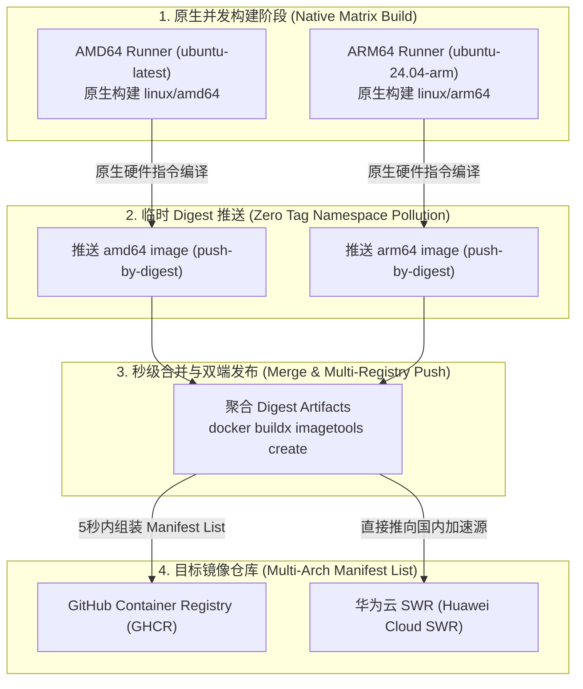

# 原生并发多架构构建方案设计（Native Matrix + Merge）
# Native Matrix + Merge Multi-Arch Build Design for CI/CD

本文档详细说明 SeaTunnelX (STX) 针对发布流水线的**原生并发多架构构建方案**（Native Matrix + Merge）的设计原理、工作流拓扑与落地方案。
This document details the architecture, workflow topology, and implementation of the **Native Matrix + Merge Multi-Architecture Build** solution for SeaTunnelX (STX) release pipelines.

---

## 1. 背景与瓶颈分析 / Background & Bottleneck Analysis

在早期的多架构镜像构建中，流水线通常依赖单一的 AMD64 Runner，配合 **QEMU 模拟器**（`docker/setup-qemu-action`）执行 ARM64 指令集的交叉构建。
In early multi-arch image builds, CI pipelines typically relied on a single AMD64 runner using the **QEMU emulator** (`docker/setup-qemu-action`) to execute cross-platform instructions for ARM64.

### 传统 QEMU 方案的瓶颈 / Bottlenecks of Traditional QEMU:
1. **仿真开销巨大**：QEMU 在用户态进行指令级转译，CPU 计算开销大，导致构建极为缓慢；
   Significant emulation overhead: QEMU translates instructions in user space, resulting in severe CPU overhead and slow builds.
2. **重型应用打包耗时过长**：以 Next.js 前端独立构建与打包（`stx-frontend`、`stx-all-in-one`）为例，单架构构建耗时在 QEMU 下长达 8~12 分钟；
   Heavy build steps take excessive time: For example, Next.js frontend standalone build (`stx-frontend`, `stx-all-in-one`) takes 8-12 minutes under QEMU emulation.
3. **串行累加**：各个镜像在单个 Runner 上串行等待，整条发版流水线常长达 15 分钟以上。
   Serial accumulation: Multiple images wait sequentially on a single runner, extending overall release time to over 15 minutes.

---

## 2. 方案核心架构 / Architecture Overview

本方案利用 GitHub 官方提供的原生 AMD64 与 ARM64 裸机算力，结合 Docker Buildx 的 `push-by-digest` 与 `imagetools create` 能力，实现**真正硬件级别的零转译并发构建**。
This solution leverages GitHub's native bare-metal AMD64 and ARM64 runners combined with Docker Buildx `push-by-digest` and `imagetools create` capabilities to achieve **true hardware-level zero-emulation concurrent builds**.



---

## 3. 工作流执行流程 / Workflow Execution Steps

### 步骤一：原生矩阵构建（Native Matrix Build）
* **并发规模**：3 个镜像（`stx-backend`、`stx-frontend`、`stx-all-in-one`）× 2 个原生平台（`linux/amd64` 在 `ubuntu-latest`，`linux/arm64` 在 `ubuntu-24.04-arm`）= **6 个原生 Worker 完全并行**。
* **构建产物**：构建产物通过 `outputs: type=image,push-by-digest=true,name-canonical=true,push=true` 推送至临时 Registry，避免污染版本 Tag。
* **Digest 提取**：将每个架构生成的 SHA256 digest 存储为轻量 Artifact 传递给 Merge 阶段。

### 步骤二：轻量 Manifest 合并（Merge & Tag）
* **执行节点**：轻量级 `ubuntu-latest` Runner（耗时仅需约 5~10 秒）。
* **操作指令**：
  ```bash
  docker buildx imagetools create \
    -t ghcr.io/<owner>/<image>:<version> \
    -t ghcr.io/<owner>/<image>:latest \
    -t swr.cn-east-3.myhuaweicloud.com/stx/<image>:<version> \
    -t swr.cn-east-3.myhuaweicloud.com/stx/<image>:latest \
    ghcr.io/<owner>/<image>@sha256:<amd64_digest> \
    ghcr.io/<owner>/<image>@sha256:<arm64_digest>
  ```
* **跨仓库同步**：`imagetools create` 原生支持一次性指定多个不同 Registry 的 `-t` 目标，同时将 Manifest List 灌入 GHCR 与华为云 SWR，无需在 Runner 本地做多重拉取和重新推包。

---

## 4. 收益对比 / Performance Comparison

| 评估维度 / Metric | QEMU 单 Runner 方案 / QEMU Single Runner | 原生并发方案 / Native Matrix + Merge |
| :--- | :--- | :--- |
| **ARM64 构建算力** | QEMU 指令级软件仿真 / Software emulation | 真实 ARM64 Neoverse 硬件内核 / Native ARM64 |
| **All-in-One 镜像构建耗时** | ~9 分钟 / ~9 min | **~2.5 分钟 / ~2.5 min (提升 ~70%)** |
| **整体发版镜像打包总耗时** | ~12-14 分钟 / ~12-14 min | **~3-4 分钟 / ~3-4 min (提速 3~4 倍)** |
| **CPU 资源争抢** | 单机 CPU 100% 满负荷 / Single host overloaded | 算力分散在多台独立 Runner / Distributed |
| **兼容性与规范** | 符合 OCI/Docker 标准 | 遵循 Docker 官方工业级标准架构 |
