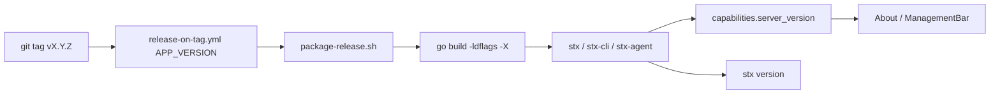

# STX 自身版本管理设计

> 分支：`features/stx-self-version`  
> 与 SeaTunnel / 集群 / 同步任务版本无关；那些已有独立链路。

## 1. 目标与非目标

### 目标（本期）

1. **单一版本源**：发版 tag、二进制、CLI、Agent、API、UI About 显示同一产品版本。
2. **构建可注入**：`go build -ldflags` 写入 Version / GitCommit / BuildTime；本地开发默认可识别。
3. **可查询**：`stx version`、`GET /api/v1/capabilities`、UI 关于页均可读到真实版本。
4. **CLI 兼容门槛落地**：`MinCLIVersion` 不只返回，CLI 启动/调用时做 soft-warn 或 hard-fail（策略见下）。

### 非目标（明确不做）

- **不做** STX 产品内一键升级器（对比 `stupgrade`）；升级仍走 `install-online.sh --version` / 重装。
- **不**把前端 `package.json` 的 npm 包版本当产品版本源（仅保留私有包元数据，可与产品版本同步脚本对齐）。
- **不**引入独立 VERSION 文件与 tag 双写冲突；tag 为发布权威，源码默认值为开发兜底。

## 2. 版本模型

```text
产品版本 ProductVersion  = SemVer，无 v 前缀存储；tag 带 v（例：v0.2.0 → 0.2.0）
构建元数据 BuildInfo     = Version + GitCommit(短) + BuildTime(ISO8601) + Component(server|cli|agent)
兼容门槛 MinCLIVersion   = SemVer，源码显式维护；发版时人工确认是否抬高
```

| 字段 | 用途 |
|------|------|
| `Version` | 用户可见产品版本 |
| `GitCommit` | 排障 / 支持 |
| `BuildTime` | 排障 |
| `MinCLIVersion` | 服务端声明 CLI 下限 |

**SemVer 约定（初期）**

- `MAJOR`：破坏性 API / 安装布局变更
- `MINOR`：向后兼容功能
- `PATCH`：修复
- 开发构建：`0.1.0-dev` 或 `dev`（未注入 ldflags 时）

首个对齐版本定为 **`1.0.0`**（tag `v1.0.0`）；源码默认、`MinCLIVersion`、前端 `package.json`、Swagger `@version` 均与此对齐。

## 3. 单一真相与注入点



### 3.1 源码包 `internal/version`

扩展为构建信息载体（示意）：

```go
var (
  Version       = "1.0.0"   // 可被 -X 覆盖；开发默认
  GitCommit     = "unknown"
  BuildTime     = "unknown"
  MinCLIVersion = "1.0.0"   // 一般不靠 ldflags；破坏兼容时手改
)

func Normalize(v string) string { /* 去掉 v 前缀、trim */ }
func Current() Info { ... }
```

Agent 通过 `replace` 引用同一 `internal/version` 包，发布构建共用一套 ldflags。

### 3.2 `package-release.sh`

对 server / agent（及若单独编 CLI）统一：

```bash
LDFLAGS=(
  "-X github.com/LeonYoah/stx/internal/version.Version=${APP_VERSION#v}"
  "-X github.com/LeonYoah/stx/internal/version.GitCommit=$(git rev-parse --short HEAD)"
  "-X github.com/LeonYoah/stx/internal/version.BuildTime=$(date -u +%Y-%m-%dT%H:%M:%SZ)"
)
go build -ldflags "${LDFLAGS[*]}" ...
```

`APP_VERSION` 已由 tag 传入；包名继续用 `APP_VERSION_SAFE`，与二进制内版本一致。

### 3.3 前端

- About / ManagementBar 读 `GET /api/v1/version`（公开接口；capabilities 仍仅 CLI）。
- 可选：构建时 `NEXT_PUBLIC_STX_VERSION` 作静态兜底（API 不可达时）；默认仍以后端为准。
- `frontend/package.json` `version`：与产品版本对齐为 `1.0.0`。

## 4. 对外表面

| 表面 | 行为 |
|------|------|
| `stx version` | JSON：`version` / `git_commit` / `build_time` |
| `GET /api/v1/version` | 公开产品版本（控制台 About） |
| `GET /api/v1/capabilities` | CLI：`server_version` / `git_commit` / `build_time` / `min_cli_version` |
| UI 关于 | 读 `/api/v1/version` |
| Agent 注册 | 上报共享 `Version` |
| 安装包 `version=` 元数据 | 与 ldflags 对齐 |

## 5. CLI ↔ Server 兼容

现状：`MinCLIVersion` 只暴露，无校验。

建议分两档（实现时二选一，推荐 A→B）：

1. **A Soft-warn（本期默认）**  
   CLI 调 capabilities 后若 `cli < min`，stderr 警告仍继续。
2. **B Hard-fail（明确破坏时开启）**  
   抬高 `MinCLIVersion` 的发版说明里写明；CLI 拒绝执行写操作。

比较逻辑可抽到 `internal/version`（或复用现有 semver 比较，避免与 SeaTunnel `CompareVersions` 语义绑死）。

## 6. 发版流程改动（最小）

1. 改 `MinCLIVersion`（若需要）→ 合并 main。
2. 打 tag `vX.Y.Z` → 现有 workflow。
3. `package-release.sh` 注入 ldflags（本设计核心代码改动）。
4. Release 产物内 `stx version` 应输出 `X.Y.Z`，与 tag 一致。
5. （可选）Release notes / CHANGELOG 人工或后续再自动化。

**仍不引入**：产品内 STX 升级任务、灰度、回滚编排。

## 7. 实施分期

| Phase | 内容 | 验收 |
|-------|------|------|
| **P0** | ldflags 注入 + `stx version` + Agent 共用版本变量 + 去掉 UI 硬编码改读 API | 打一次预发 tag 或本地 `APP_VERSION=v0.2.0` 打包，`stx version` = 0.2.0；UI About 一致 |
| **P1** | capabilities 增 commit/build_time；CLI soft-warn | 旧 CLI 警告可见 |
| **P2** | 文档：`docs/打包发布说明.md` 补「产品版本」一节；可选 CHANGELOG | 发版同学按文档操作 |
| **P3（以后）** | 控制台展示「检测到新 Release」外链提示；仍不内置升级器 | — |

## 8. 已确认决策

1. **首个对齐版本**：`v1.0.0` / `1.0.0`。
2. **Agent**：与根模块共用 `internal/version`（`replace`），同一套 ldflags。
3. **CLI 兼容**：本期 soft-warn（`cli_version_below_min`）。
4. **Swagger `@version`**：与产品版本同步为 `1.0.0`。
5. **UI**：读公开接口 `GET /api/v1/version`（capabilities 仍为 CLI 专用）。

## 9. 与现有能力对照

| 已有 | 缺口（本设计补） |
|------|------------------|
| tag → 包名 `APP_VERSION` | 二进制内 Version 未注入 |
| capabilities 返回 version | UI 不读、CLI 不展示完整 BuildInfo |
| `MinCLIVersion` 字段 | 无实际校验 |
| install 重装升级 | 保持；不产品内升级 |
